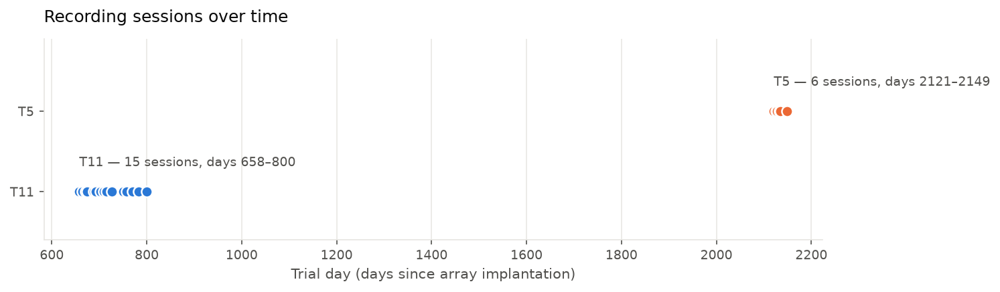
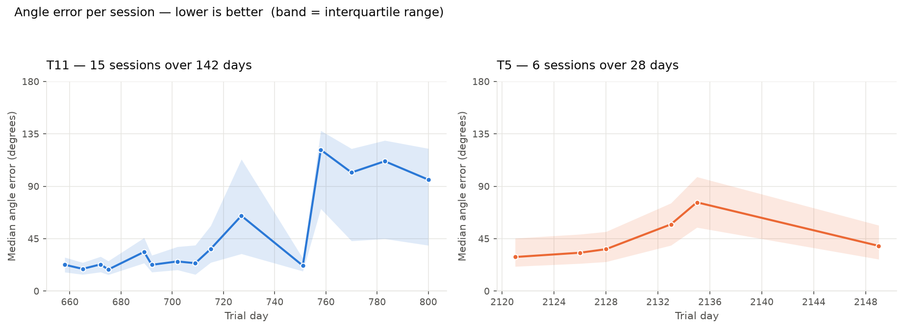
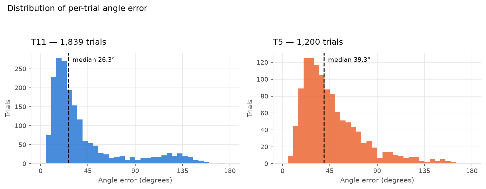
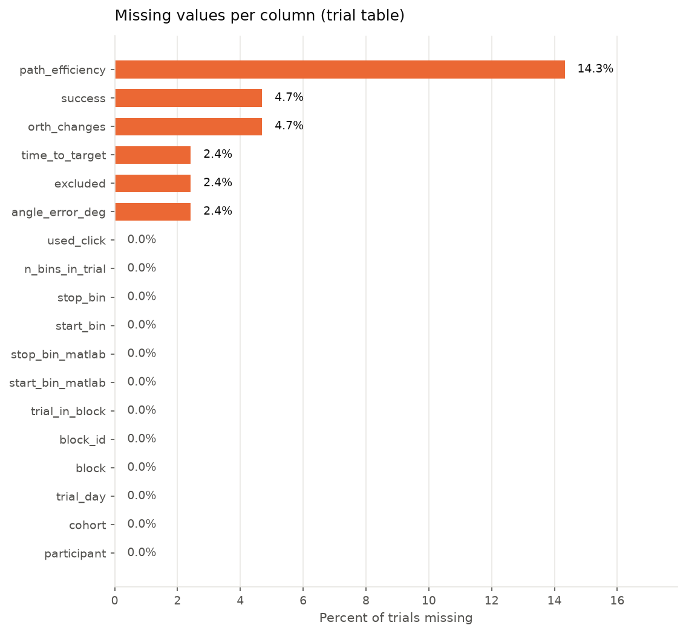
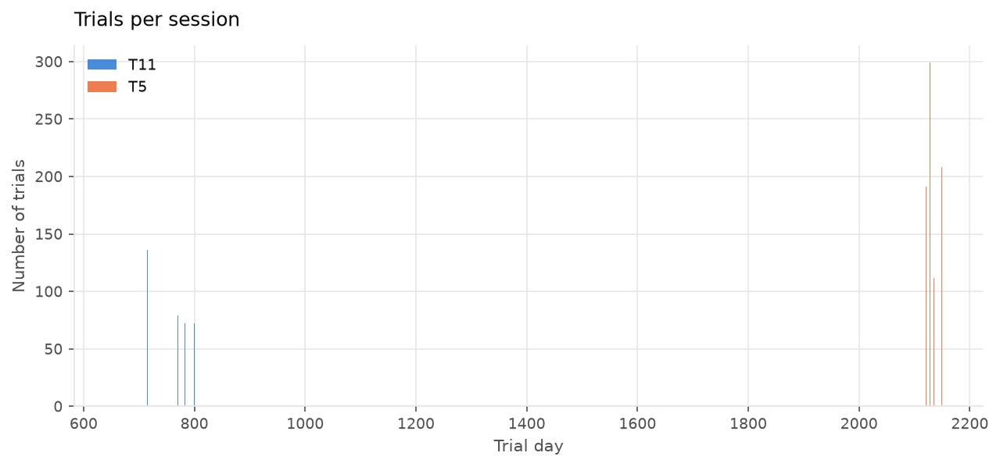
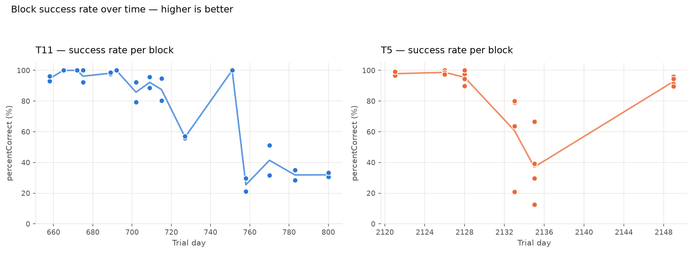

# DATASET_EXPLORATION — what is actually in this dataset

**Generated:** 2026-08-25 18:19 UTC by `scripts/04_explore_dataset.py`
**Source:** `data/raw` (Dryad DOI 10.5061/dryad.n2z34tn5s)
**Companion document:** `DATASET_README.md` (provenance, file structure, variable dictionary)

> **How to read this.** Everything under a **Computed** heading was calculated
> from the data by the script and is factual. Everything under a **Requires your
> judgement** heading is deliberately left unfilled — those are scientific
> decisions, and the script does not make them for you.

---

## 1. What the dataset contains — *Computed*

| participant | sessions | blocks | trials | bins | hours | features | day_range |
|---|---|---|---|---|---|---|---|
| T11 | 15 | 33 | 2101 | 530734 | 2.95 | 384 | 658–800 |
| T5 | 6 | 21 | 1200 | 251974 | 1.40 | 192 | 2121–2149 |

- **54 blocks** across **21 distinct trial days**,
  **3,301 trials** in total.
- At 20 ms per bin, **4.35 hours** of recording.

### Session spacing

| participant | n_gaps | min_gap_days | median_gap_days | max_gap_days | evenly_spaced |
|---|---|---|---|---|---|
| T11 | 14 | 3 | 8.50 | 24 | False |
| T5 | 5 | 2 | 5.00 | 14 | False |

> Spacing matters: most time-series methods assume evenly spaced samples. If
> `evenly_spaced` is False, that assumption is violated and any windowed
> analysis must account for it explicitly.

### Tasks present

| participant | task_name | n_blocks |
|---|---|---|
| T11 | Personal use | 2 |
| T11 | circleOfCircles | 29 |
| T11 | fitts | 2 |
| T5 | Fitts | 21 |

### Cohorts

| participant | cohort | sessions | blocks | trials |
|---|---|---|---|---|
| T11 | main | 15 | 29 | 1839 |
| T11 | personal_use | 1 | 2 | 80 |
| T11 | random_targets | 1 | 2 | 182 |
| T5 | main | 6 | 21 | 1200 |

> `main` is the primary cursor-control data. The other cohorts are alternative
> reference tasks for T11 (a personal-use web-browsing session and a
> random-target session). The figures below use `main` only, because comparing
> performance across different tasks over time would compare unlike things.

---

## 2. What the observational unit is — *Computed*

The data are **nested**:

```
participant (2)
  └── session / trial day (21 distinct)
        └── block (54)
              └── trial (3,301)
                    └── time bin (782,708 @ 20 ms)
```

- Behavioural measures are **per trial**.
- Neural features are **per 20 ms bin**.
- `start_bin` / `stop_bin` map each trial onto its bins.

**Consequence:** observations within a participant are not independent. With
**n = 2 participants**, no population-level claim is available. Any
finding is a within-participant result, replicated or not in the second person.

---

## 3. What variables are available — *Computed*

### Trial table (`data/processed/trials.csv`)

| column | dtype | missing_% | n_unique | min | median | max |
|---|---|---|---|---|---|---|
| trial_uid | str | 0.00 | 3301 |  |  |  |
| participant | str | 0.00 | 2 |  |  |  |
| cohort | str | 0.00 | 3 |  |  |  |
| trial_day | int64 | 0.00 | 21 | 658.00 | 715.00 | 2,149.00 |
| block | int64 | 0.00 | 18 | 1.00 | 6.00 | 20.00 |
| block_id | str | 0.00 | 54 |  |  |  |
| trial_in_block | int64 | 0.00 | 106 | 0.00 | 30.00 | 105.00 |
| start_bin_matlab | int64 | 0.00 | 2938 | 88.00 | 6,742.00 | 29,990.00 |
| stop_bin_matlab | int64 | 0.00 | 2956 | 176.00 | 6,984.00 | 30,185.00 |
| start_bin | int64 | 0.00 | 2938 | 87.00 | 6,741.00 | 29,989.00 |
| stop_bin | int64 | 0.00 | 2956 | 176.00 | 6,984.00 | 30,185.00 |
| n_bins_in_trial | int64 | 0.00 | 413 | 28.00 | 168.00 | 3,841.00 |
| angle_error_deg | float64 | 2.42 | 3221 | 4.97 | 30.82 | 171.26 |
| success | object | 4.70 | 2 |  |  |  |
| time_to_target | float64 | 2.42 | 378 | 0.56 | 3.32 | 10.48 |
| path_efficiency | float64 | 14.33 | 2828 | 0.01 | 0.77 | 0.99 |
| orth_changes | float64 | 4.70 | 22 | 0.00 | 1.00 | 21.00 |
| excluded | object | 2.42 | 2 |  |  |  |
| used_click | bool | 0.00 | 2 |  |  |  |

### Block table (`data/processed/blocks.csv`)

| participant | cohort | trial_day | block | block_id | task_name | task_group | n_bins | n_features | n_trials | neural_variable | duration_s_at_20ms | percent_correct | has_spike_power | has_labels | has_cursor_vel | path |
|---|---|---|---|---|---|---|---|---|---|---|---|---|---|---|---|---|
| T11 | main | 658 | 5 | T11/day_658/block_5 | circleOfCircles | circleofcircles | 15209 | 384 | 72 | nctx+spikePower | 304.18 | 93.06 | True | True | True | data/raw/extracted/MINDFUL_Data/MINDFUL_Data/T11/day_658/Block_05 |
| T11 | main | 658 | 7 | T11/day_658/block_7 | circleOfCircles | circleofcircles | 15284 | 384 | 80 | nctx+spikePower | 305.68 | 96.25 | True | True | True | data/raw/extracted/MINDFUL_Data/MINDFUL_Data/T11/day_658/Block_07 |
| T11 | main | 665 | 6 | T11/day_665/block_6 | circleOfCircles | circleofcircles | 15160 | 384 | 86 | nctx+spikePower | 303.20 | 100.00 | True | True | True | data/raw/extracted/MINDFUL_Data/MINDFUL_Data/T11/day_665/Block_06 |
| T11 | main | 665 | 7 | T11/day_665/block_7 | circleOfCircles | circleofcircles | 15157 | 384 | 78 | nctx+spikePower | 303.14 | 100.00 | True | True | True | data/raw/extracted/MINDFUL_Data/MINDFUL_Data/T11/day_665/Block_07 |
| T11 | main | 672 | 19 | T11/day_672/block_19 | circleOfCircles | circleofcircles | 15134 | 384 | 77 | nctx+spikePower | 302.68 | 100.00 | True | True | True | data/raw/extracted/MINDFUL_Data/MINDFUL_Data/T11/day_672/Block_19 |
| T11 | main | 672 | 20 | T11/day_672/block_20 | circleOfCircles | circleofcircles | 15134 | 384 | 82 | nctx+spikePower | 302.68 | 100.00 | True | True | True | data/raw/extracted/MINDFUL_Data/MINDFUL_Data/T11/day_672/Block_20 |
| T11 | main | 675 | 6 | T11/day_675/block_6 | circleOfCircles | circleofcircles | 15133 | 384 | 88 | nctx+spikePower | 302.66 | 100.00 | True | True | True | data/raw/extracted/MINDFUL_Data/MINDFUL_Data/T11/day_675/Block_06 |
| T11 | main | 675 | 7 | T11/day_675/block_7 | circleOfCircles | circleofcircles | 15134 | 384 | 79 | nctx+spikePower | 302.68 | 92.41 | True | True | True | data/raw/extracted/MINDFUL_Data/MINDFUL_Data/T11/day_675/Block_07 |
| T11 | main | 689 | 13 | T11/day_689/block_13 | circleOfCircles | circleofcircles | 15208 | 384 | 83 | nctx+spikePower | 304.16 | 97.59 | True | True | True | data/raw/extracted/MINDFUL_Data/MINDFUL_Data/T11/day_689/Block_13 |
| T11 | main | 689 | 14 | T11/day_689/block_14 | circleOfCircles | circleofcircles | 15233 | 384 | 75 | nctx+spikePower | 304.66 | 98.68 | True | True | True | data/raw/extracted/MINDFUL_Data/MINDFUL_Data/T11/day_689/Block_14 |

_(first 10 of 54 rows)_

### Neural arrays

| participant | blocks_with_neural | features | total_bins |
|---|---|---|---|
| T11 | 33 | 384 | 530734 |
| T5 | 21 | 192 | 251974 |

### Excluded trials

| participant | n_excluded | n_trials | percent |
|---|---|---|---|
| T11 | 37 | 2021 | 1.83 |
| T5 | 0 | 1200 | 0.00 |

---

## 4. Performance measures — *Computed*

| level_0 | level_1 | T11 | T5 |
|---|---|---|---|
| angle_error_deg | count | 2,021.00 | 1,200.00 |
| angle_error_deg | mean | 39.14 | 47.02 |
| angle_error_deg | std | 34.34 | 28.75 |
| angle_error_deg | min | 4.97 | 5.78 |
| angle_error_deg | 25% | 17.85 | 26.42 |
| angle_error_deg | 50% | 26.08 | 39.34 |
| angle_error_deg | 75% | 42.86 | 60.11 |
| angle_error_deg | max | 171.26 | 162.80 |
| time_to_target | count | 2,021.00 | 1,200.00 |
| time_to_target | mean | 4.53 | 4.04 |
| time_to_target | std | 2.56 | 2.78 |
| time_to_target | min | 1.38 | 0.56 |
| time_to_target | 25% | 2.84 | 2.06 |
| time_to_target | 50% | 3.46 | 2.94 |
| time_to_target | 75% | 4.86 | 4.95 |
| time_to_target | max | 10.06 | 10.48 |
| path_efficiency | count | 1,631.00 | 1,197.00 |
| path_efficiency | mean | 0.77 | 0.60 |
| path_efficiency | std | 0.16 | 0.22 |
| path_efficiency | min | 0.14 | 0.01 |
| path_efficiency | 25% | 0.71 | 0.45 |
| path_efficiency | 50% | 0.82 | 0.65 |
| path_efficiency | 75% | 0.88 | 0.78 |
| path_efficiency | max | 0.99 | 0.97 |
| orth_changes | count | 1,946.00 | 1,200.00 |
| orth_changes | mean | 2.69 | 3.52 |
| orth_changes | std | 3.87 | 3.71 |
| orth_changes | min | 0.00 | 0.00 |
| orth_changes | 25% | 0.00 | 1.00 |
| orth_changes | 50% | 1.00 | 2.00 |
| orth_changes | 75% | 3.00 | 5.00 |
| orth_changes | max | 20.00 | 21.00 |

### Recording sessions over time



### Angle error per session



### Distribution of angle error



### Missing values



### Trials per session



### Block success rate over time



---

## 5. Data quality problems flagged by the loader — *Computed*

- T11/day_689/block_14: 'trialSuccess' has 76 values but there are 75 trials; column left empty for this block
- T11/day_689/block_14: 'pathEfficiency' has 76 values but there are 75 trials; column left empty for this block
- T11/day_689/block_14: 'orthChanges' has 76 values but there are 75 trials; column left empty for this block

---

## 6. What measurements appear relevant to the research question — *Requires your judgement*

The project asks whether early-warning signals precede BCI performance
deterioration. That requires (a) a performance measure over time and (b) a
neural measure over the same time. Both exist — §3 lists them.

**Decisions only you should make, with reasons written down:**

- Which variable *operationally defines* "performance"? `angle_error_deg` is what
  the original paper uses, but `time_to_target`, `path_efficiency` and
  `orth_changes` are also present and are not the same quantity.
- What counts as "deterioration"? A threshold? A relative drop? A change point?
  Until this is defined, no analysis can be specified.
- At what level is the analysis? Per trial, per block, or per session? The
  answer changes the sample size and the meaning of the result.

---

## 7. What the dataset does NOT contain — *Computed where possible*

- **No electrode impedance measurements** and no explicit array-health variable —
  so the physical degradation parameter discussed in the literature review cannot
  be measured directly here; it can only be inferred from the neural signal.
- **Only 2 participants.** No population-level inference.
- **No ground-truth failure labels.** Nothing in the data marks a "failure event",
  so any deterioration event must be defined by you and justified.
- Anything else absent is listed in §8; verify against the Dryad README.

---

## 8. What still needs verification — *Requires your judgement*

Carried over from `DATASET_README.md` §8, still open:

1. Is the decoder genuinely fixed across all sessions, with no recalibration?
2. Are `day_<N>` values truly days since implantation?
3. Confirm the 20 ms bin width from the paper's Methods.
4. What exactly do the neural feature columns represent?
5. What criterion produced `excludeTrials`?
6. Are `angle_error` units and sign convention as assumed?

---

## 9. What preprocessing may eventually be necessary — *Requires your judgement*

Candidates suggested by what is above — **none decided**:

- Normalisation across sessions (the original code rolling z-scores; whether
  that is appropriate for an early-warning analysis is an open question, since
  normalisation can remove the very drift being studied).
- Handling the missing values quantified in §3.
- A decision on excluded trials.
- Aggregation from bins to trials or sessions.
- Handling uneven session spacing (§1).

---

## 10. What analyses appear potentially possible — *Requires your judgement*

**Not filled in deliberately.** Whether the dataset can support the research
question depends on the numbers in §1 and §4 and on the definitions in §6.
Work through those first, then write this section yourself — that is the
argument the project rests on, and it should be yours.

---

*Regenerate with:* `python3 scripts/04_explore_dataset.py`
